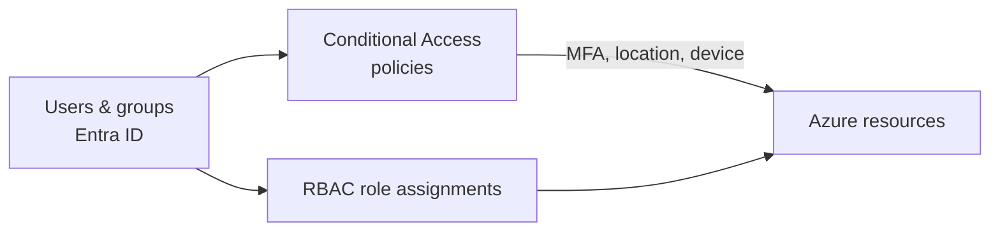

# Azure IAM Security Lab

> An Azure / Entra ID environment built to practice identity hardening: least privilege, Conditional Access and MFA.

## Architecture

## Stack
- **Microsoft Entra ID** – users, groups, roles
- **Azure RBAC** – least-privilege access to resources
- **Conditional Access & MFA** – access policies

## Setup
<!-- TODO: tenant type (free / P2 trial), groups and roles created -->

## Hardening scenarios
| Scenario | Policy | Expected result | Result |
| --- | --- | --- | --- |
| <!-- TODO e.g. block legacy authentication --> | | | |
| <!-- TODO e.g. require MFA for admins --> | | | |

## Results
<!-- TODO: screenshots of policies and sign-in logs -->

## What I learned
<!-- TODO -->

## Next steps
- Rebuild the lab as code with Terraform and a GitHub Actions pipeline
- Add PIM (just-in-time admin roles) and Access Reviews

> ⚠️ Lab tenant only.
