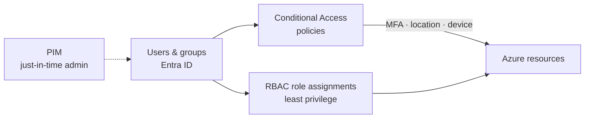

# Azure IAM Security Lab

> A Microsoft Entra ID environment to practice identity hardening — least privilege, Conditional Access and MFA — provisioned as code with Terraform so the whole lab can be rebuilt and torn down on demand.

## Architecture

## Stack
- **Microsoft Entra ID** – users, groups, roles (free tier + P2 trial for Conditional Access / PIM)
- **Azure RBAC** – least-privilege access to resources
- **Conditional Access & MFA** – access policies
- **Terraform** (`azuread` + `azurerm` providers) – infrastructure as code

## Why as code
Doing this by hand in the portal is slow and not repeatable. The Terraform here creates the groups, a least-privilege role assignment and the Conditional Access policies, so the lab is reproducible and the config is reviewable — the same reasoning behind production IAM.

| File | What it creates |
| --- | --- |
| [`terraform/main.tf`](terraform/main.tf) | Providers, security groups, example RBAC assignment |
| [`terraform/conditional_access.tf`](terraform/conditional_access.tf) | CA policies: require MFA for admins, block legacy auth |
| [`terraform/variables.tf`](terraform/variables.tf) | Tenant / subscription inputs |
| [`terraform/README.md`](terraform/README.md) | How to run it safely (CA policies start in report-only) |

## Hardening scenarios
| Scenario | Policy | Expected result | Result |
| --- | --- | --- | --- |
| Block legacy authentication | CA: legacy auth clients → Block | Basic-auth sign-ins denied | _report-only, to validate_ |
| Require MFA for admin roles | CA: directory roles → Require MFA | Admins prompted for MFA every sign-in | _report-only, to validate_ |
| Least privilege on a resource group | RBAC: Reader instead of Owner | User can view but not modify | _to validate_ |
| Require compliant / managed device | CA: grant → require device | Sign-in from unmanaged device blocked | _to validate_ |

## Rollout approach
New CA policies are deployed in **report-only** first (`state = "enabledForReportingButNotEnforced"`), the sign-in logs reviewed for what *would* have been blocked, then switched to **on**. This is how you avoid locking yourself (or users) out — a point worth making in interviews.

## Results
<!-- TODO: screenshots of CA policies, sign-in logs showing MFA/report-only, RBAC assignment -->

## What I learned
- The difference between Entra ID roles (control the directory) and Azure RBAC roles (control resources) — a common point of confusion.
- Why Conditional Access is deployed report-only first, and how to read the sign-in logs to tune a policy before enforcing it.
- Expressing identity governance as code so it can be versioned and reviewed.

## Next steps
- Add PIM (just-in-time admin roles) and Access Reviews
- Wire a GitHub Actions pipeline to `terraform plan` on pull requests

> ⚠️ Lab tenant only. No real identities or secrets committed.
